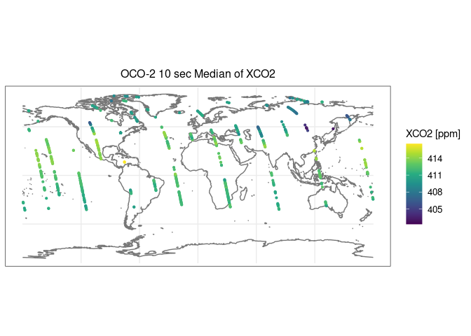

OCO-2 Data Access and Quick Aggregation
================

### Author: Jon Hobbs

### Date Authored: 2024-02-17

**Testing the earthdatalogin package for S3 access on AWS**

``` r
suppressPackageStartupMessages({ 
    library(httr2)
    library(tidyr)
    library(dplyr)
    library(ggplot2)
    library(viridisLite)
    library(earthdatalogin)
    library(purrr)
    library(stringr)
    library(aws.s3)
    library(hdf5r)
})
```

Obtain S3 credentials

``` r
edl_s3_token(daac = "https://data.gesdisc.earthdata.nasa.gov", prompt_for_netrc = FALSE)
```

## Search CMR Catalogs and Obtain S3 URLs

- Make the CMR API request for OCO-2 LtCO2 products for Version 11.1r
- The final object parses the JSON response with the product information
- `httr2` R package has similar capability to the Python `requests`
  library
- Final object has JSON response parsed

``` r
cmrurl <- 'https://cmr.earthdata.nasa.gov/search/granules'

short_name <- 'OCO2_L2_Lite_FP'
start_time <- '2020-07-05T00:00:00Z'
end_time <- '2020-07-07T00:00:00Z'
tmstr <- paste(start_time,end_time,sep=",")

rqoco <- request(cmrurl) %>% 
         req_headers("Accept" = "application/json") %>% 
         req_url_query(short_name=short_name,temporal=tmstr,page_size="200",version='11.1r') %>%
         req_method("GET") %>% req_perform()     

granv11 <- rqoco %>% resp_body_json()
```

Now, the S3 URLs of the relevant products are extracted

``` r
nprd <- length(granv11$feed$entry)
s3url <- NULL

hrefs3 <- function(lnkidx, rflst) {
    # Extract the full link from a GES DISC JSON link list
    lnkvl <- rflst[[lnkidx]]$href
    return(lnkvl)
}

for (i in seq(1,nprd)) {
    nlnk <- length(granv11$feed$entry[[i]]$links)
    mp1 <- unlist(map(seq(1,nlnk), .f= hrefs3, rflst = granv11$feed$entry[[1]]$links))
    mtchs3 <- str_detect(mp1,"s3://")
    s3url <- c(s3url,mp1[mtchs3])
}

print(s3url)
```

    ## [1] "s3://gesdisc-cumulus-prod-protected/OCO2_DATA/OCO2_L2_Lite_FP.11.1r/2020/oco2_LtCO2_200704_B11100Ar_230603215457s.nc4"
    ## [2] "s3://gesdisc-cumulus-prod-protected/OCO2_DATA/OCO2_L2_Lite_FP.11.1r/2020/oco2_LtCO2_200704_B11100Ar_230603215457s.nc4"
    ## [3] "s3://gesdisc-cumulus-prod-protected/OCO2_DATA/OCO2_L2_Lite_FP.11.1r/2020/oco2_LtCO2_200704_B11100Ar_230603215457s.nc4"
    ## [4] "s3://gesdisc-cumulus-prod-protected/OCO2_DATA/OCO2_L2_Lite_FP.11.1r/2020/oco2_LtCO2_200704_B11100Ar_230603215457s.nc4"

## Access desired datasets

- S3 direct access enabled by `aws.s3` package
- Check options for the s3fs opjects, e.g. open S3 file object before
  accessing NetCDF

``` r
# S3 access dataset
Sys.setenv("AWS_DEFAULT_REGION" = "us-west-2")
hf <- s3read_using(FUN = H5File$new, object = s3url[1])
hf$ls(recursive=FALSE)$name
```

    ##  [1] "xco2_apriori"           "vertex_latitude"        "file_index"            
    ##  [4] "vertices"               "xco2_qf_simple_bitflag" "vertex_longitude"      
    ##  [7] "pressure_levels"        "xco2"                   "source_files"          
    ## [10] "time"                   "pressure_weight"        "Preprocessors"         
    ## [13] "solar_zenith_angle"     "longitude"              "xco2_x2019"            
    ## [16] "xco2_qf_bitflag"        "latitude"               "sensor_zenith_angle"   
    ## [19] "levels"                 "Meteorology"            "xco2_quality_flag"     
    ## [22] "sounding_id"            "xco2_averaging_kernel"  "Auxiliary"             
    ## [25] "bands"                  "date"                   "Retrieval"             
    ## [28] "Sounding"               "xco2_uncertainty"       "co2_profile_apriori"   
    ## [31] "epoch_dimension"

``` r
lat <- hf[['latitude']][]
lon <- hf[['longitude']][]
qflg <- hf[['xco2_quality_flag']][]
ltxco2 <- hf[['xco2']][]
ltsdg <- hf[['sounding_id']][]
hf$close_all()

table(qflg)
```

    ## qflg
    ##     0     1 
    ## 91004 67297

``` r
lttbl <- tibble(SoundingID=as.vector(ltsdg), Latitude=as.vector(lat), Longitude=as.vector(lon),
                XCO2=as.vector(ltxco2), V11QFlag=as.vector(qflg))
lttbl <- lttbl %>% mutate(Sdg10s = floor(SoundingID / 1.0e3))
lttbl <- lttbl %>% filter(V11QFlag == 0)
```

``` r
print(head(lttbl))
```

    ## # A tibble: 6 × 6
    ##   SoundingID Latitude Longitude  XCO2 V11QFlag        Sdg10s
    ##        <dbl>    <dbl>     <dbl> <dbl>    <int>         <dbl>
    ## 1    2.02e15    -38.3     -152.  412.        0 2020070400004
    ## 2    2.02e15    -36.7     -153.  413.        0 2020070400011
    ## 3    2.02e15    -34.6     -153.  411.        0 2020070400015
    ## 4    2.02e15    -34.6     -153.  410.        0 2020070400015
    ## 5    2.02e15    -34.6     -153.  412.        0 2020070400015
    ## 6    2.02e15    -34.6     -153.  411.        0 2020070400015

### Group and Summarize

``` r
# Use the pivot_longer, pivot_wider approach
ltlng <- lttbl %>% pivot_longer(cols = c("XCO2","Latitude","Longitude"), names_to = "GeoVar",
                             names_prefix="", values_to = "value")
ltgrp <- ltlng %>% group_by(Sdg10s,GeoVar) %>% summarise(Med = median(value,na.rm=TRUE), NSmp=n()) %>% ungroup()
```

    ## `summarise()` has grouped output by 'Sdg10s'. You can override using the
    ## `.groups` argument.

``` r
ltgrp <- ltgrp %>% filter(NSmp > 30)
ltwdr <- ltgrp %>% pivot_wider(id_cols = c("Sdg10s"), names_from=c("GeoVar"), names_prefix=c("Med_"), 
                               values_from="Med")
```

``` r
# Map results
suppressPackageStartupMessages({ 
    library("rnaturalearth")
    library("rnaturalearthdata")
    library(sf)
})


theme_mat = theme_bw() 
theme_mat$axis.title.x$size = 11
theme_mat$axis.text.x$size = 10
theme_mat$axis.title.y$size = 11
theme_mat$axis.text.y$size = 10
theme_mat$plot.title$size = 12
theme_mat$legend.position = "right"
theme_mat$plot.title$hjust = 0.5
theme_mat$strip.text$size = 11
theme_mat$legend.text$size = 10
theme_mat$legend.title$size = 11

mrg_fnl <- as.data.frame(ltwdr)
mrg_fnl_sf <- st_as_sf(mrg_fnl, coords = c("Med_Longitude", "Med_Latitude"), 
                        crs = 4326, agr = "constant")

world <- ne_coastline(scale = "medium", returnclass = "sf")
p9 = viridis(9)

ltmap <- ggplot(data = world) + geom_sf(color = '#777777') + 
  geom_sf(data = mrg_fnl_sf,aes(color=Med_XCO2), size=0.8) +
  scale_color_gradientn("XCO2 [ppm]",colors=p9)  + 
  theme_mat +  ggtitle("OCO-2 10s Median XCO2")  

ltmap
```

<!-- -->
